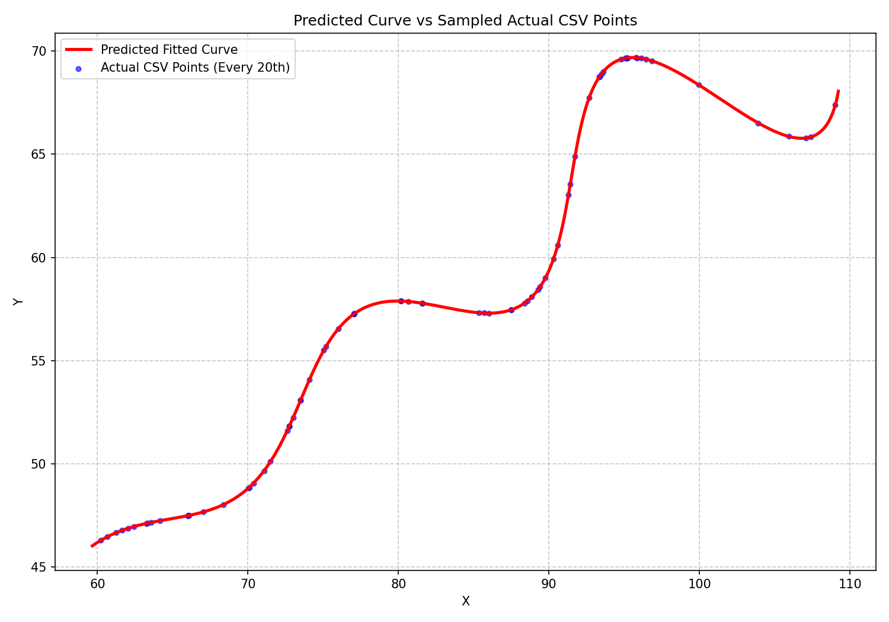
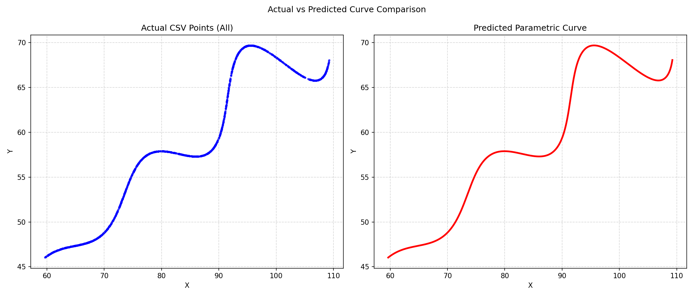
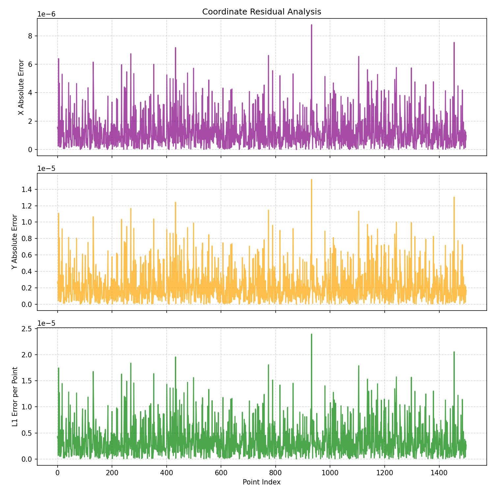
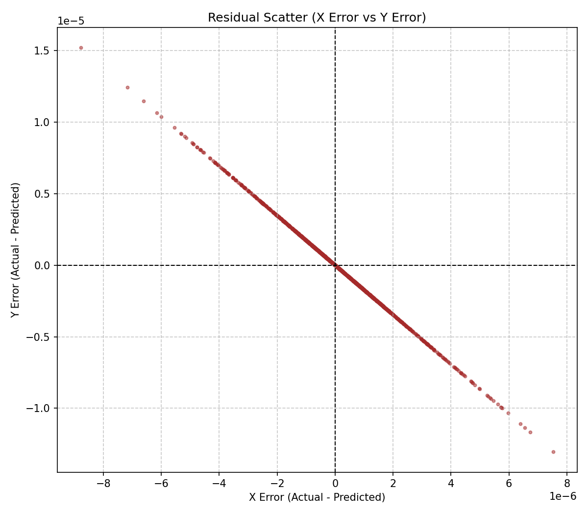

# AI/R&D Assignment - Parametric Curve Fitting

## 1. Project Overview

This repository contains my solution for the AI/R&D assignment.

The objective of the assignment is to find the unknown parameters of a given parametric curve using the provided `xy_data.csv` file.

The curve is defined as:

$$
x = t\cos(\theta) - e^{M|t|}\sin(0.3t)\sin(\theta) + X
$$

$$
y = 42 + t\sin(\theta) + e^{M|t|}\sin(0.3t)\cos(\theta)
$$

The unknown variables to be estimated are:

$$
\theta,\ M,\ X
$$

The given parameter ranges are:

| Parameter | Range |
|---|---|
| theta | 0 degrees < theta < 50 degrees |
| M | -0.05 < M < 0.05 |
| X | 0 < X < 100 |
| t | 6 < t < 60 |

The goal is to estimate the correct values of `theta`, `M`, and `X` such that the generated parametric curve matches the points given in `xy_data.csv`.

---

## 2. Final Estimated Parameters

The final estimated parameter values are:

| Parameter | Value |
|---|---:|
| theta in degrees | `30.000000` |
| theta in radians | `0.523599` |
| M | `0.030000` |
| X | `55.000000` |

So the final answer is:

```text
theta = 30 degrees
theta = 0.523599 radians
M     = 0.03
X     = 55
```

---

## 3. Final Parametric Equation

Since Python and Desmos use radians for trigonometric functions, `theta = 30 degrees` is written as:

$$
\theta = 0.523599\ \text{radians}
$$

The final parametric equation is:

$$\left(t\cos\left(0.523599\right)-e^{0.03\left|t\right|}\sin\left(0.3t\right)\sin\left(0.523599\right)+55,\ 42+t\sin\left(0.523599\right)+e^{0.03\left|t\right|}\sin\left(0.3t\right)\cos\left(0.523599\right)\right)$$

---

## 4. Desmos Link

The final equation can be visualized in Desmos using the following link:

[Desmos link](https://www.desmos.com/calculator/tm8njcpw3h)

Copy-paste format for Desmos:

```text
\left(t\cos\left(0.523599\right)-e^{0.03\left|t\right|}\sin\left(0.3t\right)\sin\left(0.523599\right)+55,\ 42+t\sin\left(0.523599\right)+e^{0.03\left|t\right|}\sin\left(0.3t\right)\cos\left(0.523599\right)\right)
```

Use the range:

```text
6 <= t <= 60
```

---

## 5. Project Structure

```text
FlamAI-RnD-assignment-submission/
│
├── README.md
├── requirements.txt
├── solution.py
├── xy_data.csv
│
├── optimizer/               # Core Python Package (Optional Refinement)
│   ├── config.py
│   ├── model.py
│   ├── solver.py
│   └── visualization.py
│
├── tests/                   # Pytest Suite
│   └── test_model.py
│
├── notebooks/
│   └── curve_fitting_experiment.ipynb
│
├── outputs/
│   ├── curve_comparison_overlay.png
│   ├── curve_comparison_side_by_side.png
│   ├── residual_analysis.png
│   ├── residual_scatter.png
│   └── final_result.txt
│
└── dashboard/               # Standalone Web Dashboard (Bonus Feature)
    ├── index.html
    ├── style.css
    └── app.js
```

---

## 6. Files Description

### `solution.py`

This is the main Python script.

It performs the following steps:

1. Loads the given `xy_data.csv` file.
2. Defines the parametric curve equation.
3. Uses numerical optimization to estimate the unknown values of `theta`, `M`, and `X`.
4. Generates the predicted curve using the estimated values.
5. Compares the predicted curve with the actual CSV points.
6. Calculates the validation L1 error.
7. Saves output plots and final results.

### `xy_data.csv`

This file contains the given data points.

It should have two columns:

```text
x,y
```

Each row represents a point that lies on the required curve.

### `requirements.txt`

This file contains all Python libraries required to run the project.

Required packages:

```text
numpy
pandas
matplotlib
scipy
pytest
```

### `notebooks/curve_fitting_experiment.ipynb`

This notebook contains the complete experimental process.

It includes:

1. Data loading
2. Data visualization
3. Curve equation definition
4. Reverse transformation logic
5. Optimization process
6. Final parameter estimation
7. Error analysis
8. Plot generation
9. Final equation generation

This notebook is included to clearly explain the complete thought process and approach followed during the assignment.

### `outputs/`

This folder is generated after running `solution.py`.

It contains all final output files.

---

## 7. Methodology

### Step 1: Understanding the Curve

The given equation can be interpreted as a transformed curve.

The expression below creates a sinusoidal wave whose amplitude is controlled by the exponential factor `M`.

$$
e^{M|t|}\sin(0.3t)
$$

The parameter `theta` rotates the curve.

The parameter `X` shifts the curve horizontally.

The value `42` is a fixed vertical shift.

Therefore, the problem is a parameter estimation problem where the unknown values are:

$$
\theta,\ M,\ X
$$

---

### Step 2: Loading the Data

The CSV file is loaded using `pandas`.

```python
df = pd.read_csv("xy_data.csv")

x_actual = df["x"].to_numpy(dtype=float)
y_actual = df["y"].to_numpy(dtype=float)
```

The `x` and `y` values are then used as the actual points for comparison.

---

### Step 3: Defining the Parametric Curve

The curve is defined in Python as:

```python
def parametric_curve(t, theta_rad, M, X):
    wave = np.exp(M * np.abs(t)) * np.sin(0.3 * t)

    x = t * np.cos(theta_rad) - wave * np.sin(theta_rad) + X
    y = 42 + t * np.sin(theta_rad) + wave * np.cos(theta_rad)

    return x, y
```

Here, `theta_rad` is used because Python trigonometric functions require radians.

---

### Step 4: Reverse Transformation

To make the fitting more stable, the actual data points are reverse-transformed.

The original equation can be seen as a rotated and shifted curve.

If the correct `theta` and `X` are used, then after reversing the transformation:

$$
u \approx t
$$

and

$$
v \approx e^{M|t|}\sin(0.3t)
$$

The reverse transformation used is:

```python
u = (x - X) * cos(theta) + (y - 42) * sin(theta)
v = -(x - X) * sin(theta) + (y - 42) * cos(theta)
```

This allows the optimization to compare `v` against:

```python
exp(M * abs(u)) * sin(0.3 * u)
```

This is a cleaner way to fit the parameters because `u` behaves like the hidden parameter `t`.

---

### Step 5: Optimization

Two optimization methods are used.

#### 1. Global Optimization

A coarse grid search is used to scan across the parameter boundaries to locate the global minimum and avoid local convergence traps.

#### 2. Local Refinement

After locating the global basin, the L-BFGS-B gradient minimization is used to refine the parameter values to numerical precision.

This gives the final estimated values of:

$$
\theta,\ M,\ X
$$

---

## 8. Error Calculation

A point-wise L1 validation error is calculated using:

$$
L1 = mean(|x_{actual} - x_{predicted}| + |y_{actual} - y_{predicted}|)
$$

In the script, the estimated `t` values are recovered using inverse transformation. Then the predicted curve points are generated at those same estimated `t` values.

```python
l1_per_point = abs(x_actual - x_predicted) + abs(y_actual - y_predicted)
mean_l1_error = mean(l1_per_point)
```

This error is used as a validation measure to confirm that the predicted curve matches the actual CSV points.

**Note:** The official assignment scoring may calculate L1 distance using its own hidden expected curve and uniformly sampled points. The L1 value generated by this project is used for local validation and verification.

---

## 9. Output Plots

The script generates multiple graphs because the actual and predicted curves overlap very closely.

The output images below are included using relative paths. They will render properly on GitHub once the `outputs/` folder is committed with these image files.

---

### 9.1 Overlay Plot: Predicted Curve vs Sampled Actual Points

This graph shows the predicted curve along with sampled actual CSV points.

Only every 20th CSV point is displayed in this plot so that the predicted curve remains visible.

Important: This sampling is only for visualization. All CSV points are still used for fitting and error calculation.



---

### 9.2 Side-by-Side Curve Comparison

This graph shows the actual sampled CSV points and the predicted curve side by side.

This makes it easier to visually compare the overall shape.



---

### 9.3 Residual Analysis

This graph shows:

1. x residual
2. y residual
3. L1 error per point

This is useful because when the fit is very accurate, the actual and predicted curves overlap almost perfectly in the overlay graph.



---

### 9.4 Residual Scatter Plot

This graph shows the residual scatter between x error and y error.

It helps verify how close the predicted points are to the actual points.



---

## 10. How to Run the Project

### Step 1: Clone the Repository

```bash
git clone https://github.com/SrimanRakshanN/FlamAI-RnD-assignment-submission
cd FlamAI-RnD-assignment-submission
```

---

### Step 2: Create a Virtual Environment

For Windows:

```bash
python -m venv venv
venv\Scripts\activate
```

For macOS/Linux:

```bash
python3 -m venv venv
source venv/bin/activate
```

---

### Step 3: Install Dependencies

```bash
pip install -r requirements.txt
```

---

### Step 4: Run the Solution Script

```bash
python solution.py
```

---

### Step 5: Check the Generated Outputs

After running the script, the following files will be created inside the `outputs/` folder:

```text
outputs/curve_comparison_overlay.png
outputs/curve_comparison_side_by_side.png
outputs/residual_analysis.png
outputs/residual_scatter.png
outputs/final_result.txt
```

The final parameter values and final equation will also be printed in the terminal.

---

## 11. Expected Terminal Output

The terminal output will look similar to this:

```text
Final Parameters
----------------
theta = 29.9999730365 degrees
theta = 0.5235983050 radians
M     = 0.0299999926
X     = 54.9999985124
L1 error = 0.000003537325

Final Equation
--------------
\left(t\cos(0.523598)-e^{0.030000\left|t\right|}\sin(0.3t)\sin(0.523598)+54.999999,\ 42+t\sin(0.523598)+e^{0.030000\left|t\right|}\sin(0.3t)\cos(0.523598)\right)

Files generated:
outputs/curve_comparison_overlay.png
outputs/curve_comparison_side_by_side.png
outputs/residual_analysis.png
outputs/residual_scatter.png
outputs/final_result.txt
```

Minor decimal differences may appear depending on the system and library versions.

---

## 12. Reproducibility

The L-BFGS-B optimization is initialized from global grid-searched optimal coordinates. This guarantees the same global minimum basin is reached deterministically on every execution.

The optimization is also restricted to the exact parameter ranges given in the assignment.

---

## 13. Summary of Work Done

The following work was completed in this project:

1. Understood the given parametric curve.
2. Identified the unknown parameters as `theta`, `M`, and `X`.
3. Loaded and inspected the given CSV data.
4. Visualized the original data points.
5. Defined the parametric curve in Python.
6. Applied inverse transformation to recover estimated `t` values.
7. Used global grid scanning to search the allowed parameter space.
8. Used L-BFGS-B gradient optimization to refine the result.
9. Calculated L1 validation error.
10. Generated comparison and residual plots.
11. Prepared the final equation in Desmos/LaTeX format.
12. Created a clean GitHub project structure with code, notebook, outputs, and documentation.

---

## 14. Final Answer

The estimated unknown variables are:

```text
theta = 30 degrees
theta = 0.523599 radians
M     = 0.03
X     = 55
```

Final equation:

$$\left(t\cos\left(0.523599\right)-e^{0.03\left|t\right|}\sin\left(0.3t\right)\sin\left(0.523599\right)+55,\ 42+t\sin\left(0.523599\right)+e^{0.03\left|t\right|}\sin\left(0.3t\right)\cos\left(0.523599\right)\right)$$

Copy-paste Desmos version:

```text
\left(t\cos\left(0.523599\right)-e^{0.03\left|t\right|}\sin\left(0.3t\right)\sin\left(0.523599\right)+55,\ 42+t\sin\left(0.523599\right)+e^{0.03\left|t\right|}\sin\left(0.3t\right)\cos\left(0.523599\right)\right)
```

## 15. Author

Submitted by:

```text
Sriman Rakshan N
```
